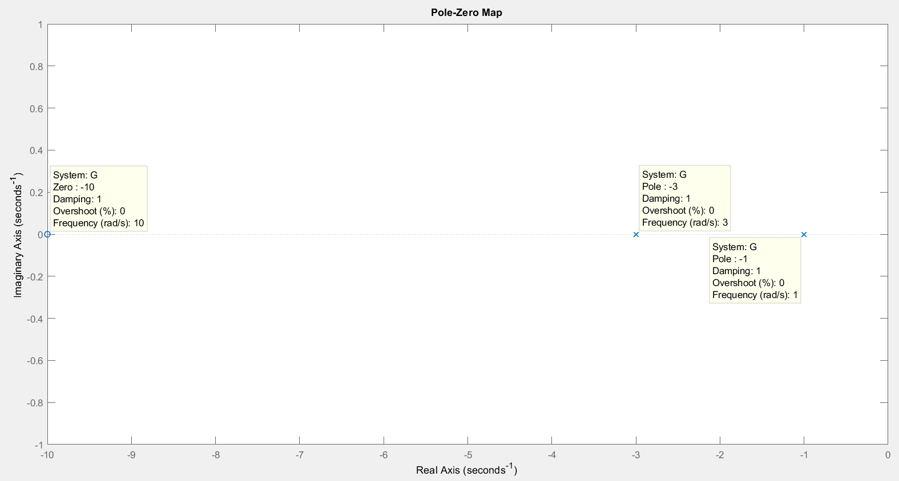
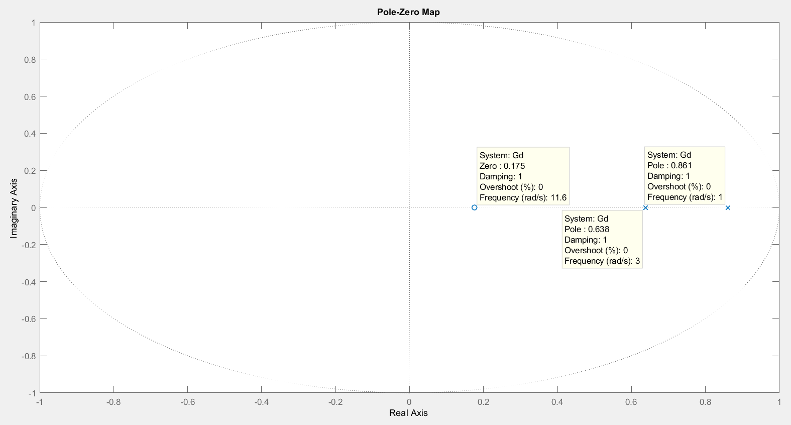
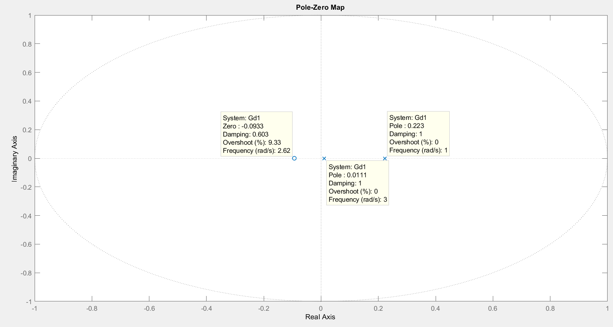
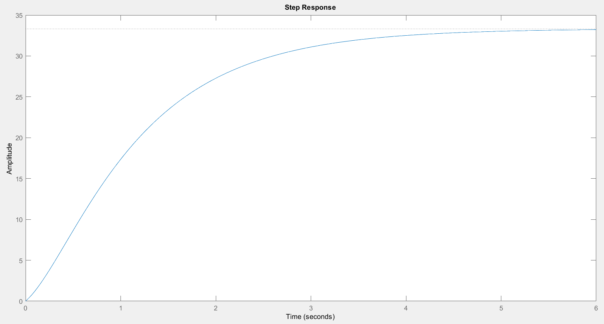
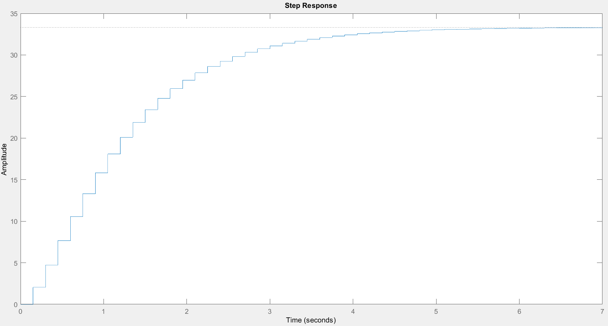
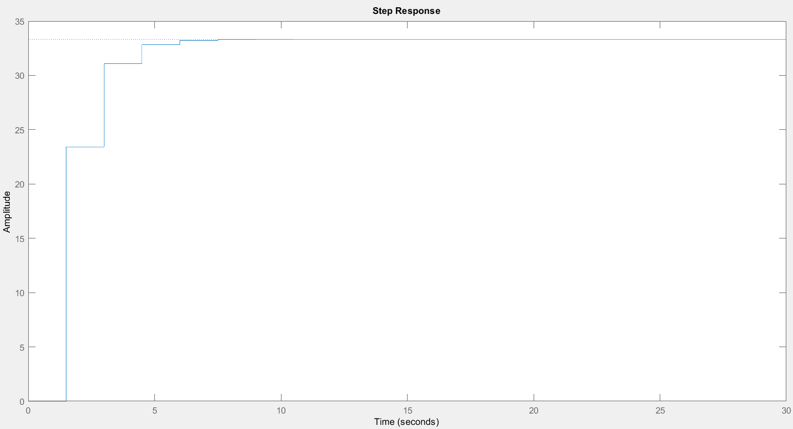
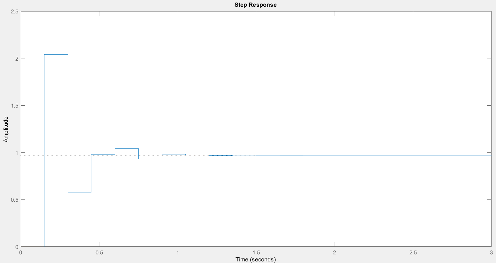
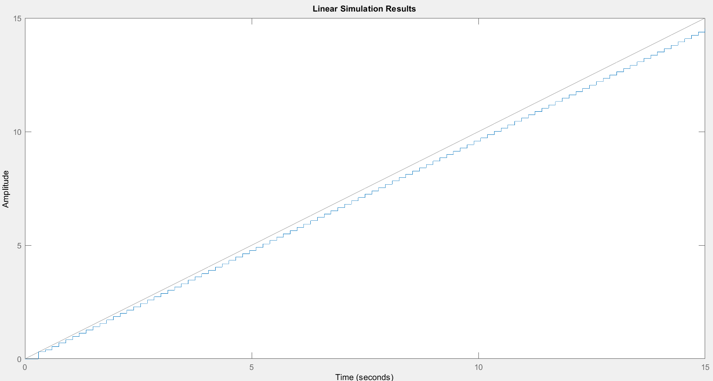
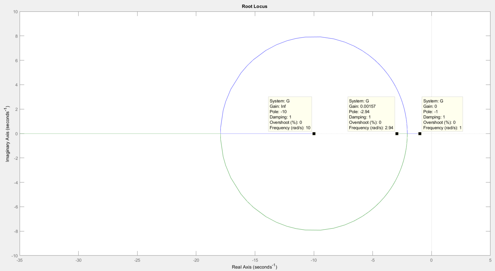
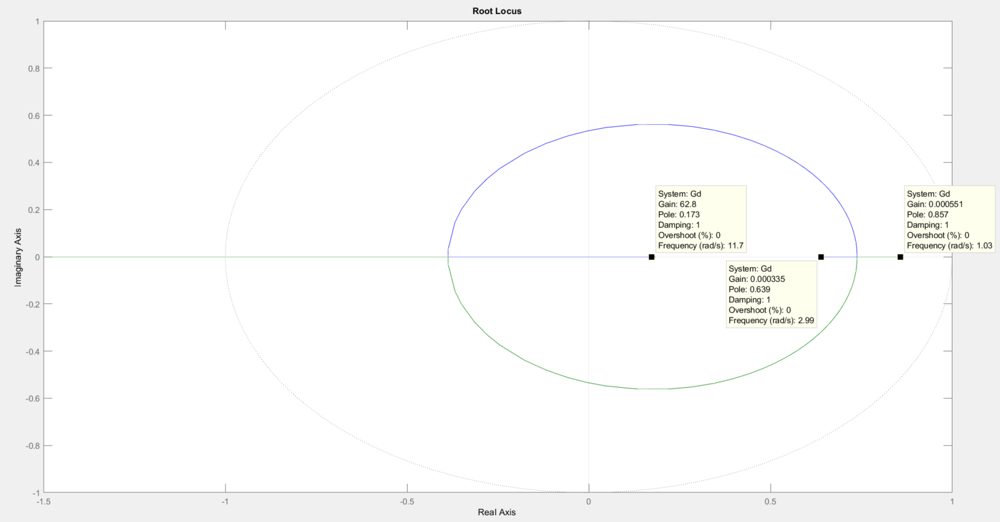

# Tarea N°1 : Sistema de Control II

## Tabla de contenidos
1. [Objetivo](#objetivo)
2. [A lazo abierto](#a-lazo-abierto)
3. [Análisis para el sistema discreto](#análisis-para-el-sistema-discreto)
4. [A lazo cerrado con realimentación unitaria](#a-lazo-cerrado-con-realimentación-unitaria)
5. [Código de Matlab](#código_de_matlab)
6. [Conclusiones](#conclusiones)
   
---

## Objetivo

El objetivo de este trabajo es adquirir experiencia práctica sobre los conceptos teóricos abordados en las clases 1 y 2, en las cuales se trabajaron los siguientes objetivos específicos:

1. **Fundamentos de controles digitales**  
   - Comprender los procesos de muestreo y reconstrucción de señales.

2. **Transformada Pulso y Transformada Z**  
   - Analizar la relación entre la transformada Pulso y la transformada Z.

3. **Funciones de transferencia discretas**  
   - Determinar funciones de transferencia discretas para sistemas con muestreadores y retentores de orden cero.

4. **Equivalencia entre planos s y z**  
   - Relacionar los planos s y z con:
     - Tiempos de establecimiento.
     - Frecuencias naturales amortiguadas y no amortiguadas.
     - Coeficientes de amortiguamiento constantes.

5. **Respuesta transitoria de sistemas discretos**  
   - Analizar sistemas de primer y segundo orden, y estudiar la influencia de la ubicación de polos y ceros en la respuesta transitoria.

6. **Estabilidad y errores en régimen permanente**  
   - Evaluar la estabilidad y comportamiento de los errores en estado estacionario.

7. **Método de lugar de raíces para sistemas digitales**  
   - Aplicar la extensión del método de lugar de raíces en el análisis de sistemas digitales.

## Desarrollo

Datos indicados para la realización del trabajo:

| Polo1 | Polo2 | Cero | Ganancia | Sobrepaso | Tiempo 2% | Error | Tiempo Muestreo |
|-------|-------|------|----------|-----------|-----------|-------|-----------------|
| -3    | -1    | -10  | 10       | 5         | 2         | 0     | 0.15            |

---

## A lazo abierto

### Obtener la función de transferencia continua G(s)

Utilizando el comando 'zpk()' obtengo la función de transferencia en tiempo continuo del sistema.

- Código del Matlab

```
%%Lazo Abierto
clear all; close all; clc;
%Datos de la Tarea
z1=-10; p1=-3; p2=-1;K=10; Tm=0.15;
%Funciones de Transferencia
G=zpk([z1],[p1 p2],[K])    %FT de tiempo continuo G(s)
```

- Función de Transferencia para Tiempo Continuo

```
     10 (s+10)
G = -----------
    (s+3) (s+1)
```

Podemos observar que es un sistema de segundo orden, ya que el denominador tiene dos factores lineales (s+3) y (s+1). En cuanto a la estabilidad, un sistema es estable si todos sus polos se encuentrasn en el semiplano izquierdo del plano complejo, y como se observa ambos polos poseén parte real negativa, por lo que podemos decir que el sistema es estable.

### Hallar la FT discreta de lazo abierto $G_D$(s) del sistema de la figura con ZOH a la entrada y el tiempo de muestreo asignado Tm.


- Código del Matlab

```
%%Lazo Abierto
clear all; close all; clc;
%Datos de la Tarea
z1=-10; p1=-3; p2=-1;K=10; Tm=0.15;
%Funciones de Transferencia
G=zpk([z1],[p1 p2],[K])    %FT de tiempo continuo G(s)
Gd=c2d(G,Tm,'zho')         %FT de tiempo discreto Gd(s)
```

- Función de Transferencia para Tiempo Discreto

```
       2.0405 (z-0.1754)
Gd = ---------------------
     (z-0.8607) (z-0.6376)
```

En este caso, la función de transferencia discreta mantiene la misma estructura que la continua, pero adaptada al dominio de 𝑧, con polos y ceros específicos que determinan el comportamiento del sistema. En el caso de los sistemas discretos, la estabilidad se determina por la ubicación de los polos en el círculo unitario del plano z, por lo que podemos decir que el sistema es estable, dado que los polos tienen valores <1.

- Dibujar el mapa de polos y ceros del sistema continuo el discreto

- Código del Matlab

```
%%Lazo Abierto
clear all; close all; clc;
%Datos de la Tarea
z1=-10; p1=-3; p2=-1;K=10; Tm=0.15;
%Funciones de Transferencia
G=zpk([z1],[p1 p2],[K])    %FT de tiempo continuo G(s)
Gd=c2d(G,Tm,'zho')         %FT de tiempo discreto Gd(s)
%Graficas de las FT
figure('Name', 'Mapa de Polos-Zeros de FT tiempo Continuo'), pzmap(G);        
figure('Name', 'Mapa de Polos-Zeros de FT tiempo Discreto'), pzmap(Gd);
```

- Gráfica Tiempo Continuo



- Gráfica Tiempo Discreto



### ¿Qué ocurre con el mapa si se multiplica por 10 el periodo de muestreo?

En este caso, los polos y ceros de $G_(D1)$(z) se desplazan, lo que indica que al aumentar el tiempo de muestreo, el sistema pierde resolución en la representación discreta, y sus características dinámicas podrían volversa más lentas o con menor precisión en comparación con el caso de $G_D$(z). Este tipo de cambios refleja cómo el tiempo de muestreo influye directamente en la respuesta de un sistema discreto.

- Código del Matlab

```
%%Lazo Abierto
clear all; close all; clc;
%Datos de la Tarea
z1=-10; p1=-3; p2=-1;K=10; Tm=0.15;
%Funciones de Transferencia
G=zpk([z1],[p1 p2],[K])    %FT de tiempo continuo G(s)
Gd=c2d(G,Tm,'zho')         %FT de tiempo discreto Gd(s)
Gd1=c2d(G,10*Tm,'zho')     %FT de tiempo discreto Gd1(s) - Aumento 10 veces el Tm
%Graficas de las FT
figure('Name', 'Mapa de Polos-Zeros de FT tiempo Continuo'), pzmap(G);        
figure('Name', 'Mapa de Polos-Zeros de FT tiempo Discreto'), pzmap(Gd);
figure('Name', 'Mapa de Polos-Zeros de FT tiempo Discreto (10xTm)'), pzmap(Gd1);
```
``` 
       23.422 (z+0.09333)
Gd1 = ----------------------
      (z-0.2231) (z-0.01111)
```

- Gráfica Tiempo Discreto



### Obtener la respuesta al escalon del sistema discreto y determinar si es estable

- Código del Matlab

```
%%Lazo Abierto
clear all; close all; clc;
%Datos de la Tarea
z1=-10; p1=-3; p2=-1;K=10; Tm=0.15;
%Funciones de Transferencia
G=zpk([z1],[p1 p2],[K])    %FT de tiempo continuo G(s)
Gd=c2d(G,Tm,'zho')         %FT de tiempo discreto Gd(s)
Gd1=c2d(G,10*Tm,'zho')     %FT de tiempo discreto Gd1(s) - Aumento 10 veces el Tm
%% Graficas de las FT
figure('Name', 'Mapa de Polos-Zeros de FT tiempo Continuo'), pzmap(G);        
figure('Name', 'Mapa de Polos-Zeros de FT tiempo Discreto'), pzmap(Gd);
figure('Name', 'Mapa de Polos-Zeros de FT tiempo Discreto (10xTm)'), pzmap(Gd1);
%% Graficas de los escalones
figure('Name', 'Respuesta al Escalon Tiempo Continuo'), step(G);
figure('Name', 'Respuesta al Escalon Tiempo Discreto'), step(Gd);
figure('Name', 'Respuesta al Escalon Tiempo Discreto (10xTm)'), step(Gd1);
```

- Respuesta al Escalon Tiempo Continuo



- Respuesta al Escalon Tiempo Discreto



- Respuesta al Escalon Tiempo Discreto (10xTm)



La respuesta al escalón muestra que el sistema es estable, alcanzando un valor de amplitud constante sin oscilaciones ni sobrepasos. Al comparar ambas respuestas, se observa una forma semejante, lo que indica que la discretización conserva las características dinámicas esenciales del sistema continuo. Por lo tanto, podemos decir que el sistema es estable, a su vez podemos observar que al multiplicar por 10 el tiempo de muestreo el sistema tiene una respuesta más lenta.

---

## Análisis para el sistema discreto

### Determinar el tipo de sistema

La función discreta $G_D$ representa un sistema de tipo 0, ya que no posee integradores puros (no tiene polos en z=1). Este tipo de sistema puede seguir entradas escalón con un error en estado estacionario finito, pero no es capaz de rastrear adecuadamente señales de tipo rampa o parabólica. Además, su estabilidad queda garantizada por los polos dentro del círculo unitario, asegurando una respuesta transitoria convergente.

### Determinar la constante de error de posición $K_P$ y el error ante un escalon y verificar mediante respuesta al escalon de lazo cerrado del sistema discreto como se muestra


- Código del Matlab

```
%Datos de la Tarea
z1=-10; p1=-3; p2=-1;K=10; Tm=0.15;
%Funciones de Transferencia
G=zpk([z1],[p1 p2],[K])    %FT de tiempo continuo G(s)
Gd=c2d(G,Tm,'zho')         %FT de tiempo discreto Gd(s)
Gd1=c2d(G,10*Tm,'zho')     %FT de tiempo discreto Gd1(s) - Aumento 10 veces el Tm
%%Sistema Discreto
Kp=dcgain(Gd), F=feedback(Gd,1), figure('Name', 'Respuesta al Escalon'), step(F) %Constante de error de posición
```
- La constante de error de posición $K_P$ representa la ganancia estática del sistema ante una entrada escalón en lazo cerrado. Para el sistema discreto analizado, se obtuvo:
```
Kp = 33.3333
```
Esto indica que el sistema posee una capacidad de seguimiento eficiente ante una entrada escalón. El error en estado estacionario se calcula como:
$ e_{ss} = \frac{1}{1 + K_P} = \frac{1}{1 + 33.3333} = 0.0291 $
Esto equivale a un error del 2.91% de la entrada deseada.
  
- La función de transferencia en lazo cerrado es: 
```
      2.0405 (z-0.1754)
F = ------------------------
    (z^2 + 0.5421z + 0.1909)
```
Esta función evidencia un comportamiento de segundo orden, con un tiempo de asentamiento rápido y polos dentro del círculo unitario, lo cual asegura la estabilidad.

- La simulación de la respuesta al escalón en lazo cerrado muestra que el sistema alcanza un valor final estable, validando la estabilidad en lazo cerrado y corroborando un error finito, característico de un sistema tipo 0.

- Respuesta al Escalon



### Verificar error ante una rampa de entrada, ¿ converge o diverge? Explique la causa

- Código del Matlab

```
%Datos de la Tarea
z1=-10; p1=-3; p2=-1;K=10; Tm=0.15;
%Funciones de Transferencia
G=zpk([z1],[p1 p2],[K])    %FT de tiempo continuo G(s)
Gd=c2d(G,Tm,'zho')         %FT de tiempo discreto Gd(s)
Gd1=c2d(G,10*Tm,'zho')     %FT de tiempo discreto Gd1(s) - Aumento 10 veces el Tm
%%Sistema Discreto
Kp=dcgain(Gd), F=feedback(Gd,1), figure('Name', 'Respuesta al Escalon'), step(F) %Constante de error de posición
t=0:Tm:100*Tm; %Genera Rampa
figure('Name', 'Rampa de entrada'), lsim(F,t,t);
```

- Rampa de entrada



El error ante una entrada rampa diverge. Esto ocurre porque el sistema discreto analizado es del tipo 0, lo cual implica que no puede rastrear entradas rampa sin error en régimen permanente.
En sistemas tipo 0, el error en estado estacionario para una entrada rampa es infinito. Esto se debe a que no tienen polos en el origen del plano z , lo que implica que no hay integradores en la dinámica del sistema para compensar la pendiente constante de la rampa.  
La constante de error de velocidad $K_V$ para este sistema es 0, lo que confirma que el sistema no puede reducir el error ante una rampa.
La divergencia del error ante una rampa es una característica inherente a los sistemas tipo 0. Para mejorar este comportamiento, sería necesario modificar la estructura del controlador, por ejemplo, agregando un integrador para convertir el sistema a tipo 1.

---

## A lazo cerrado con realimentación unitaria

### Graficar el lugar de raíces del sistema continuo G(s) y del discreto $G_D$(s) indicando las ganancias criticas de estabilidad (si las hubiera)

- Código del Matlab

```
%Datos de la Tarea
z1=-10; p1=-3; p2=-1;K=10; Tm=0.15;
%Funciones de Transferencia
G=zpk([z1],[p1 p2],[K])    %FT de tiempo continuo G(s)
Gd=c2d(G,Tm,'zho')         %FT de tiempo discreto Gd(s)
Gd1=c2d(G,10*Tm,'zho')     %FT de tiempo discreto Gd1(s) - Aumento 10 veces el Tm
%%Sistema Discreto
Kp=dcgain(Gd), F=feedback(Gd,1), figure('Name', 'Respuesta al Escalon'), step(F) %Constante de error de posición
t=0:Tm:100*Tm; %Genera Rampa
figure('Name', 'Rampa de entrada'), lsim(F,t,t);
%%Lazo cerrado con realimentación unitaria
figure('Name', 'Lugar de Raices - FT Tiempo Continuo'),rlocus(G)
figure('Name', 'Lugar de Raices - FT Tiempo Discreto'),rlocus(Gd)
figure('Name', 'Lugar de Raices - FT Tiempo Discreto (10xTm)'),rlocus(Gd1);
```

- Lugar de Raices - FT Tiempo Continuo



La gráfica muestra el lugar de raíces del sistema continuo G(s), con los polos iniciales en -2 y -1, y el cero en -10.
- Ganancia Crítica de Estabilidad:
  - En el sistema continuo, la estabilidad depende de que los polos permanezcan en el semiplano izquierdo (eje real negativo).
  - Ganancia Crítica: Infinita, ya que los polos siempre permanecen en el semiplano izquierdo.

- Lugar de Raices - FT Tiempo Discreto



La gráfica muestra el lugar de raíces del sistema discreto $G_D(s)$, con los polos iniciales dentro del círculo unitario en el plano z.

- Ganancia Crítica de Estabilidad:
  - En el sistema discreto, la estabilidad depende de que los polos permanezcan dentro del círculo unitario.
  - Existe una ganancia crítica aproximadamente de 1.14, según los datos mostrados en la gráfica.

### ¿ Que ocurre con la estabilidad relativa si se aumenta 10 veces el tiempo de muestreo original ?

- Código del Matlab

```
%Datos de la Tarea
z1=-10; p1=-3; p2=-1;K=10; Tm=0.15;
%Funciones de Transferencia
G=zpk([z1],[p1 p2],[K])    %FT de tiempo continuo G(s)
Gd=c2d(G,Tm,'zho')         %FT de tiempo discreto Gd(s)
Gd1=c2d(G,10*Tm,'zho')     %FT de tiempo discreto Gd1(s) - Aumento 10 veces el Tm
%%Sistema Discreto
Kp=dcgain(Gd), F=feedback(Gd,1), figure('Name', 'Respuesta al Escalon'), step(F) %Constante de error de posición
t=0:Tm:100*Tm; %Genera Rampa
figure('Name', 'Rampa de entrada'), lsim(F,t,t);
%%Lazo cerrado con realimentación unitaria
figure('Name', 'Lugar de Raices - FT Tiempo Continuo'),rlocus(G)
figure('Name', 'Lugar de Raices - FT Tiempo Discreto'),rlocus(Gd)
figure('Name', 'Lugar de Raices - FT Tiempo Discreto (10xTm)'),rlocus(Gd1);
```

Al aumentar 10 veces el tiempo de muestreo original, los polos del sistema discreto $G_{D1}(s)$ se mueven más cerca del origen (cero) del plano z, en lugar de acercarse al borde del círculo unitario.

- Ganancia Crítica de Estabilidad:
  - En el sistema discreto $G_{D1}(s)$, la estabilidad depende de que los polos permanezcan dentro del círculo unitario.
  - El punto marcado corresponde a una ganancia crítica aproximada de 0.048.
  - Si la ganancia supera este valor, uno o más polos saldrán del círculo unitario, provocando la inestabilidad del sistema.

---

## Código de Matlab

```
%Tarea N-1
%Profesor: Laboret, Sergio
%Alumno: Scarlatto, Manuel
%Materia: Sistema de Control 2
%%Lazo Abierto
clear all; close all; clc;
%Datos de la Tarea
z1=-10; p1=-3; p2=-1;K=10; Tm=0.15;
%Funciones de Transferencia
G=zpk([z1],[p1 p2],[K])    %FT de tiempo continuo G(s)
Gd=c2d(G,Tm,'zho')         %FT de tiempo discreto Gd(s)
Gd1=c2d(G,10*Tm,'zho')     %FT de tiempo discreto Gd1(s) - Aumento 10 veces el Tm
%% Graficas de las FT
figure('Name', 'Mapa de Polos-Zeros de FT tiempo Continuo'), pzmap(G);        
figure('Name', 'Mapa de Polos-Zeros de FT tiempo Discreto'), pzmap(Gd);
figure('Name', 'Mapa de Polos-Zeros de FT tiempo Discreto (10xTm)'), pzmap(Gd1);
%% Graficas de los escalones
figure('Name', 'Respuesta al Escalon Tiempo Continuo'), step(G);
figure('Name', 'Respuesta al Escalon Tiempo Discreto'), step(Gd);
figure('Name', 'Respuesta al Escalon Tiempo Discreto (10xTm)'), step(Gd1);
%% Sistema Discreto
Kp=dcgain(Gd), F=feedback(Gd,1), figure('Name', 'Respuesta al Escalon'), step(F) %Constante de error de posición
t=0:Tm:100*Tm; %Genera Rampa
figure('Name', 'Rampa de entrada'), lsim(F,t,t);
%% Lazo cerrado con realimentación unitaria
figure('Name', 'Lugar de Raices - FT Tiempo Continuo'),rlocus(G);
figure('Name', 'Lugar de Raices - FT Tiempo Discreto'),rlocus(Gd);
figure('Name', 'Lugar de Raices - FT Tiempo Discreto (10xTm)'),rlocus(Gd1);
```

---

## Conclusiones

En este trabajo se aplicaron los conceptos fundamentales de los sistemas de control digital, abordando tanto el análisis de sistemas discretos como continuos. Se logró obtener las funciones de transferencia en ambos dominios y analizar su comportamiento mediante herramientas como mapas de polos y ceros, respuestas transitorias y análisis de estabilidad.

Los resultados obtenidos confirmaron que el sistema estudiado es estable, tanto en lazo abierto como en lazo cerrado, y que la discretización conserva las características esenciales del sistema continuo, siempre que se utilice un tiempo de muestreo adecuado. Además, el análisis mostró que el tiempo de muestreo seleccionado permite representar correctamente las dinámicas del sistema sin alterar significativamente su desempeño.

En términos de error, el sistema mostró buen desempeño ante entradas escalón, con un error en estado estacionario reducido, pero presentó divergencia ante entradas tipo rampa debido a su naturaleza de tipo 0. Esto evidencia la necesidad de incorporar integradores o estrategias de control adicionales para mejorar su capacidad de seguimiento en escenarios más exigentes.

Este análisis permite comprender la relación entre los parámetros de diseño, las características dinámicas y la estabilidad en sistemas digitales, proporcionando una base sólida para abordar problemas más complejos en controles discretos.

---
