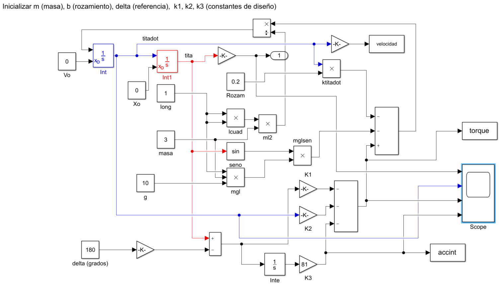
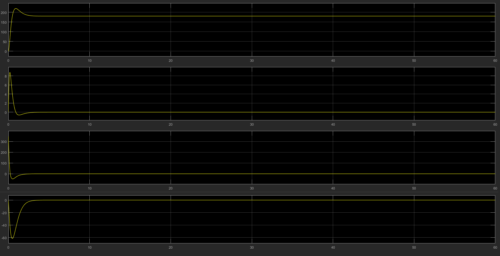
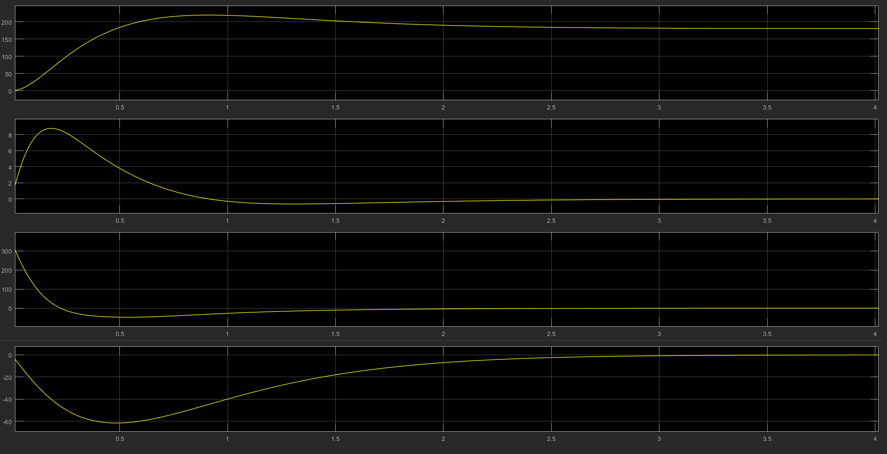
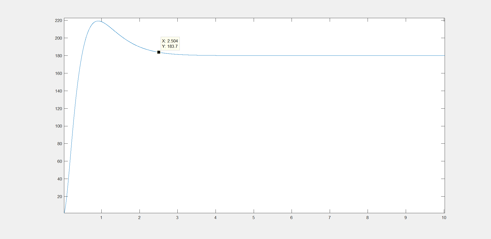
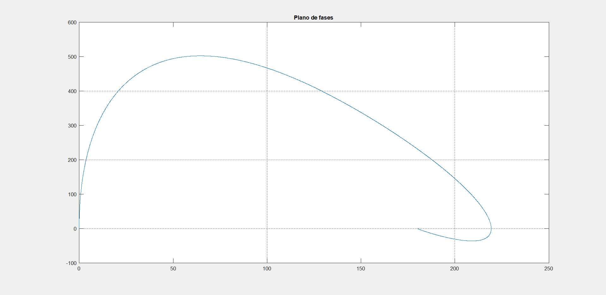
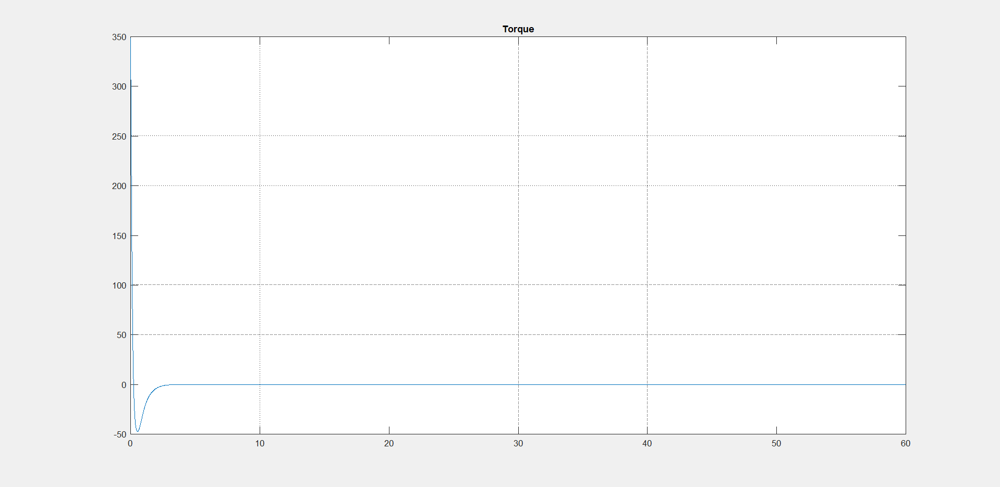
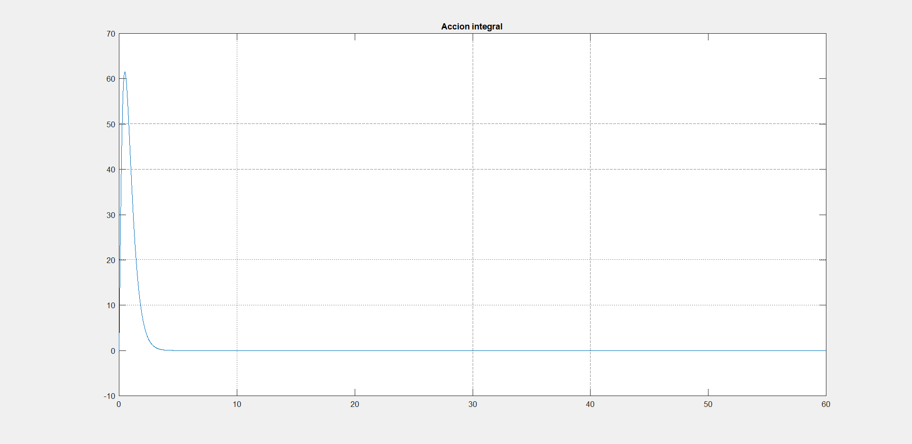

# Tarea N°3 : Sistema de Control II

## Tabla de contenidos
1. [Objetivo](#objetivo)
2. [Desarrollo](#desarrollo)
3. [Conclusiones](#conclusiones)

---

## Objetivo

- Diseñar y analizar un sistema de control continuo basado en un modelo no lineal de un péndulo simple con realimentación de estados y acción integral.  
- Cumplir con las siguientes especificaciones:
  - Estabilización en una posición angular de referencia dada $\delta = 180°$.
  - Controlador robusto frente a variaciones del parámetro de masa $\pm 10\%$.

---

## Desarrollo

Datos indicados para la realización del trabajo:

| m (kg) | b (N·m·s) | l (m) | g (m/s²) | Delta (°) | Polo triple |
|--------|-----------|-------|----------|------------|--------------|
| 3      | 0.2       | 1     | 10       | 180        | -3           |

Se dispondrá para cada alumno una tabla con valores de masa (m), longitud (1), coeficiente de rozamiento (b), constante gravitatoria g (10) y ángulo de referencia en grados (delta) de un péndulo simple con la ecuación:

$$ml^2 \ddot{\theta} + b\dot{\theta} + mgl\sin(\theta) = T$$

Se desea que el péndulo se estabilice en el ángulo \( \delta \) dado, tomando como estados, entrada y salida respectivamente (nótese que se ha desplazado el punto de equilibrio al origen, tomando el error como salida):


$$x_1 = \theta - \delta = e $$
$$x_2 = \dot{\theta}$$
$$u = T$$ 
$$y = e$$

- Hallar el sistema dinámico en VE

Para hallar el sistema dinámico, se realizan las siguientes asignaciones:

$$x_1 = \theta - \delta = e$$
$$\dot{x}_1 = \dot{\theta} = x_2$$
$$x_2 = \dot{\theta}$$ 
$$\dot{x}_2 = \ddot{\theta}$$


$$\dot{x}_2 = \ddot{\theta} = \frac{T - b \cdot \dot{\theta} - m \cdot g \cdot l \cdot \sin(\theta)}{m \cdot l^2}
= \frac{T}{m \cdot l^2} - \frac{b \cdot \dot{\theta}}{m \cdot l^2} - \frac{g \cdot \sin(\theta)}{l}$$


Sustituyendo con las variables de estado y el cambio de coordenadas:

$$\dot{x}_2 = \frac{u}{m \cdot l^2} - \frac{b \cdot x_2}{m \cdot l^2} - \frac{g \cdot \sin(x_1 + \delta)}{l}$$

Definiendo:

$$\alpha = \frac{1}{m \cdot l^2}, \quad \beta = \frac{g}{l}$$

Se obtiene el sistema en forma de espacio de estados no lineal:

$$\dot{x}_1 = x_2$$
$$\dot{x}_2 = \alpha u - \alpha b x_2 - \beta \sin(x_1 + \delta)$$

- Hallar el torque estático necesario $u_f$ para que el sistema tenga como punto de equilibrio el origen, es decir $f(0, u_f) = 0$

Para que el sistema tenga como punto de equilibrio el origen, el torque debe tener una componente estática que compense la fuerza de la gravedad. Por lo tanto, la acción de control debe ser:

$$u = T - T_f \quad \Rightarrow \quad T = u + T_f$$

Para hallar $T_f$, se utiliza la ecuación hallada valuada en el origen, es decir $f(0, u_f) = 0$ :

$$\dot{x}_2 = f(0, u_f) = \alpha u_f - \alpha b \cdot 0 - \beta \cdot \sin(0 + \delta) = 0$$

$$u_f = \frac{\beta \cdot \sin(\delta)}{\alpha} = \frac{\frac{g}{l} \cdot \sin(\delta)}{\frac{1}{m \cdot l^2}} = mgl \cdot \sin(\delta)$$


$$u_f = 3 \cdot 10 \cdot 1 \cdot \sin(180^\circ) = 0$$

Ahora se reemplaza T en la ecuación del sistema para obtener el modelo desplazado al origen:

$$\dot{x}_1 = f_1(x,u) = x_2$$
$$\dot{x}_2 = f_2(x,u) = \ddot{\theta} = \alpha u - \alpha b x_2 - \beta \cdot [\sin(x_1 + \delta) - \sin(\delta)]$$

- Linealizar el sistema mediante la jacobiana

La forma general del sistema linealizado es:

$$\dot{x} = A x + B u $$
$$y = C x$$

Evaluando en el punto de equilibrio:


$$\begin{bmatrix}
x_1 \\
x_2 \\
u
\end{bmatrix}
=
\begin{bmatrix}
0 \\
0 \\
u_f
\end{bmatrix}
$$

Se comienza calculando las matrices del sistema linealizado:


$$A = 
\begin{bmatrix}
0 & 1 \\
-\dfrac{g}{l} \cdot \cos(\delta) & -\dfrac{b}{m \cdot l^2}
\end{bmatrix}
$$

$$
B = 
\begin{bmatrix}
0 \\
\dfrac{1}{m \cdot l^2}
\end{bmatrix}
$$

$$
C = 
\begin{bmatrix}
1 & 0
\end{bmatrix}
$$

```
A =

         0    1.0000
   10.0000   -0.0667
```
```
B =

         0
    0.3333
```
```
C =

     1     0
```

- Hallar los autovalores de A y determinar estabilidad por el método indirecto de Lyapunov

```
eig(A)

ans =

    3.1291
   -3.1958
```
Se determina la estabilidad del sistema por el método indirecto de Lyapunov, el cual utiliza los autovalores de la matriz 𝐴. Se establece que si los autovalores:
- Si todos los autovalores tienen parte real negativa, el origen del sistema no lineal es asintóticamente estable.
- Si al menos uno tiene parte real positiva, el origen del sistema no lineal es inestable.
- Sin parte real positiva ni nulos, pero hay al menos uno sobre el eje jw (parte real exactamente cero), el método no concluye y se requieren otras herramientas (análisis no lineal completo).

En este caso se obtuvo

$$\lambda_1 = 3.1291, \quad \lambda_2 = -3.1958$$

Como uno de ellos tiene parte real positiva, se concluye que el origen del sistema no lineal es inestable.

- Código Matlab
```
%Tarea N-3
%Profesor: Laboret, Sergio
%Alumno: Scarlatto, Manuel
%Materia: Sistema de Control 2
%%
clear all; close all; clc;
%%
m = 3
b = 0.2
delta= 180%en grados
l=1,G=10
[A,B,C,D]=linmod('pendulo_mod_tarea',delta*pi/180)
eig(A)
rank(ctrb(A,B))
```

- Encontrar las matrices del sistema ampliado:

$$A_A = 
\begin{bmatrix}
A & 0 \\
C & 0
\end{bmatrix},
B_A = 
\begin{bmatrix}
B \\
0
\end{bmatrix}$$

Entonces:

```
Aa =

         0    1.0000         0
   10.0000   -0.0667         0
    1.0000         0         0
```
```
Ba =

         0
    0.3333
         0
```

- Verificar autovalores, estabilidad y controlabilidad del nuevo par

```
eig(Aa)

ans =

         0
   -3.1958
    3.1291
```
```
rank(ctrb(Aa,Ba))

ans =

     3
```
Podemos decir estonces que la matriz ampliada de A es controlable, ya que vemos que el rango es igual a 3.

- Código Matlab

```
m = 3
b = 0.2
delta= 180%en grados
l=1,G=10
[A,B,C,D]=linmod('pendulo_mod_tarea',delta*pi/180)
eig(A)
rank(ctrb(A,B))
%%Matriz ampliada
Aa=[[A;C] zeros(3,1)]
Ba=[B;0]
eig(Aa)
rank(ctrb(Aa,Ba))
```

- Diseñar por asignación de polos un controlador con la orden acker() de matlab

$$u = -[k_1 \quad k_2 \quad k_3] 
\begin{bmatrix}
x_1 \\
x_2 \\
\sigma
\end{bmatrix}$$

Para ubicar un **polo triple** \( p \), lo cual daría una **respuesta sin sobrepaso** (si el sistema fuera lineal y no tuviera ceros de lazo cerrado), el **tiempo de establecimiento (2%)** sería:

$$t_{ss} \approx \frac{7.5}{-p}$$

A travez del código siguiente: 

```
%%Controlador con la orden acker()
p= -3%dato
K=acker(Aa,Ba,[p p p])
k1=K(1)
k2=K(2)
k3=K(3)
eig(Aa-Ba*K) % polos lazo cerrado
tscalc=7.5/(-p) % tiempo de respuesta calculado
```

Obtenemos

```
K =

  111.0000   26.8000   81.0000
```
Obteniendo así los polos y el tiempo de respuesta:

```
ans =

  -3.0000 + 0.0000i
  -3.0000 + 0.0000i
  -3.0000 - 0.0000i


tscalc =

    2.5000
```

- Simular el péndulo con PID como se muestra en la figura partiendo del origen con velocidad nula y referencia $\delta$ (dato).

Esquema del controlador



Respuesta del sistema (Simulink)



Haciendo zoom, se puede observar que el tiempo de establecimiento es cercano a 2,5 seg.



Ahora, ejecutando el código siguiente en Matlab, obtenemos:

```
sim('pendulo_PID_tarea')
figure(1), plot(tout,yout)
grid on, title('Salida')
figure(2), plot(yout,velocidad) %plano de fase
grid on, title('Plano de fases')
figure(3), plot(tout,torque) % torque total
grid on, title('Torque')
figure(4), plot(tout,-accint) % acción integral
grid on, title('Accion integral')
ymax=max(yout) % máximo valor de salida
S=(ymax-delta)/delta*100 % sobrepaso en %
erel=(delta-yout)/delta; %error relativo
efinal=erel(end) % error final, debe ser cero
ind=find(abs(erel)>.02); % índice elementos con error relativo absoluto menor a 2%
tss=tout(ind(end)) % tiempo de establecimiento (ultimo valor del vector)
yte=yout(ind(end)) % salida al tiempo ts
uf=torque(end) % torque final
Intf=-accint(end) % acción integral final
```

Obtenemos a la salida:









- Analizar la robustez variando la masa del péndulo en mas y menos 10% analizar los nuevos
valores de sobrepaso, tiempo de establecimiento y acción de control final, elaborar una tabla
con los resultados para los distintos valores de masa

---