# Trabajo Práctico N°1 : Representación de sistemas y controladores

**Materia:** Sistemas de Control II  
**Carrera:** Ingeniería Electrónica   
**Profesor:** Dr. Ing. J. A. Pucheta  
**Alumno:** Apellido, Nombre  
**Año:** 2025  

---

## Tabla de contenidos
1. [Caso de estudio 1. Sistema de dos variables de estado](#caso_de_estudio_1)
2. [Caso de estudio 2. Sistema de tres variables de estado](#caso_de_estudio_2)

---
## Caso de estudio 1. Sistema de dos variables de estado

<figure>
  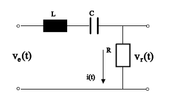
  <figcaption><em>Figura 1-1. Esquemático del circuito RLC.</em></figcaption>
</figure>

Sea el sistema eléctrico de la figura 1-1, con las representaciones en variables de estado

$$ \dot{x}(t) = A x(t) + b u(t) \tag{1-1} $$

$$ y = c^T x(t) \tag{1-2} $$

donde las matrices contienen a los coeficientes del circuito:

$$ A = \begin{bmatrix} -\frac{R}{L} & -\frac{1}{L} \\ \frac{1}{C} & 0 \end{bmatrix}, \quad b = \begin{bmatrix} \frac{1}{L} \\ 0 \end{bmatrix} \tag{1-3} $$

$$ c^T = [R \quad 0] \tag{1-4} $$

<figure>
  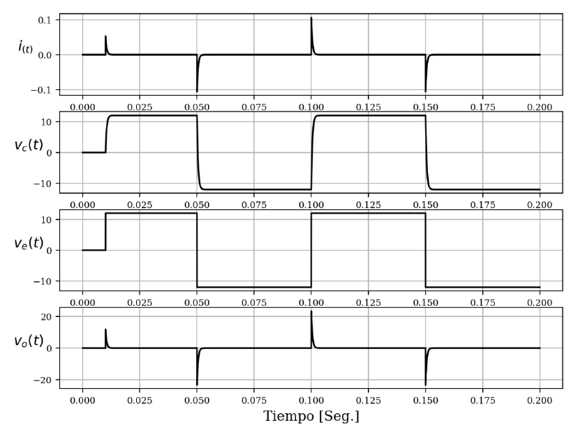
  <figcaption><em>Figura 1-2. Curvas del circuito RLC para una entrada de 12V.</em></figcaption>
</figure>

### Ítem [1] 
Asignar valores a **R = 220 Ω**, **L = 500 mH**, y **C = 2,2 μF**. Obtener simulaciones que permitan estudiar la dinámica del sistema, con una entrada de tensión escalón de **12 V**, que cambia de signo cada **10 ms**.

### Ítem [2]
En el archivo [**Curvas_Medidas_RLC_2025.xls**](Curvas_Medidas_RLC_2025.xls) (datos en la **hoja 1** y etiquetas en la **hoja 2**) están las series de datos que sirven para deducir los valores de **R**, **L** y **C** del circuito. Emplear el **método de la respuesta al escalón**, tomando como salida la **tensión en el capacitor**.

### Ítem [3]
Una vez determinados los parámetros **R**, **L** y **C**, emplear la **serie de corriente desde 0.05 seg en adelante** para validar el resultado **superponiendo las gráficas**.

## Desarrollo

### Ítem [1]

Realizamos la simulación, siendo la tensión de entrada la que vemos en la siguiente gráfica:

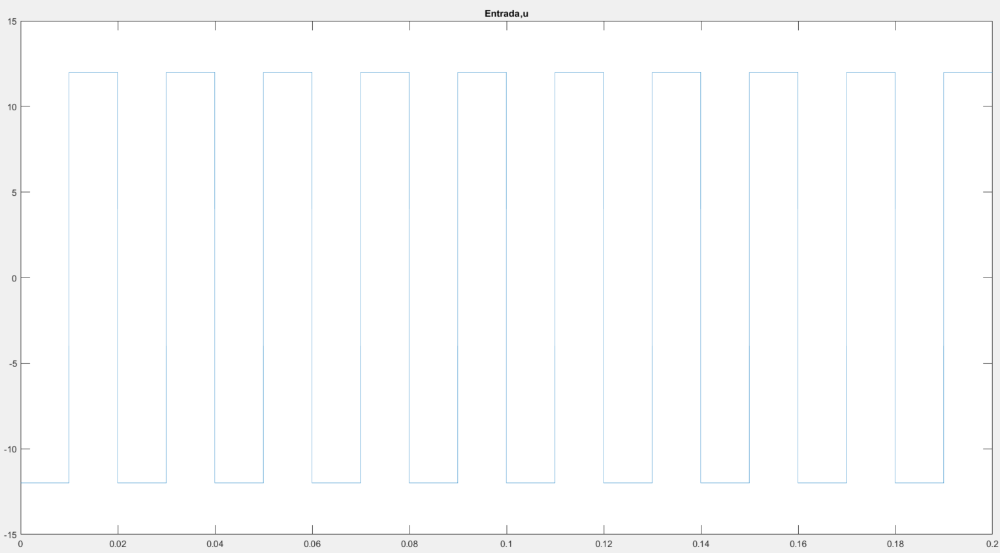

Con los valores solicitados para el circuito RLC, la respuesta en tensión y corriente es la siguiente:

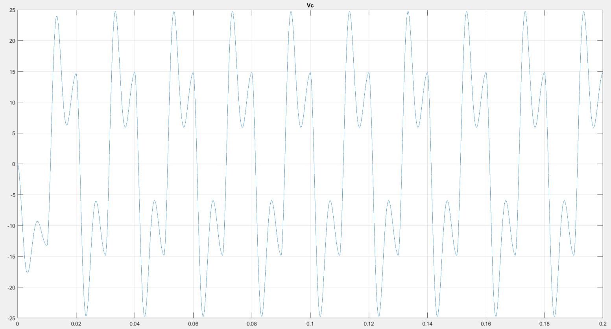

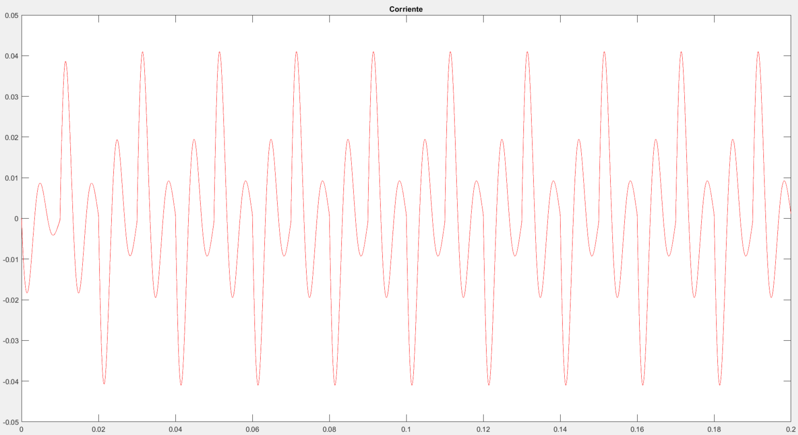

El circuito RLC responde de manera oscilante porque está subamortiguado. Cada vez que la señal escalón cambia de signo, se genera un intercambio de energía entre la inductancia y la capacitancia, lo que produce esas oscilaciones tan características. Como la resistencia del circuito es baja no alcanza a frenarlas del todo, las oscilaciones no se terminan de apagar antes de que llegue un nuevo cambio en la entrada. Esto hace que la corriente y la tensión sigan un patrón ondulante que se repite con el tiempo.

### Código Matlab Ítem [1]

```
%% Item [1]
% Datos de constantes
R = 220;       % 220 ohm
L = 500e-3;    % 500 mH
C = 2.2e-6;    % 2.2 uF

T=0.2; Kmax = 20000; At=T/Kmax; t= 0:At:(T-At);
%hago que el escalon que cambie de signo
u = zeros(1, Kmax);
signo = true;
for i = 1:Kmax
    if mod(i, 1000) == 1   % Cada 10 ms ? 1000 pasos
        signo = ~signo;
    end
    u(i) = 12 * (2*signo - 1);  % 12 o -12
end


% Para ver la tension en el capacitor
% %Matrices
A = [-R/L  -1/L ; 1/C 0];
B =[1/L ; 0];
c =[0 1];%Vc como salida
D=0;

sys1=ss(A,B,c,D) %modelo de variables de estado
figure(1)
y=lsim(sys1,u,t);
plot(t,y);title('Vc');grid on;hold on

figure(2)
plot(t,u);title('Entrada,u');hold on;

%Para ver la corriente
%Matrices
A2 = [-R/L  -1/L ; 1/C 0];
B2 =[1/L ; 0];
c2 =[1  0];%corriente como salida
D2=0;

sys2=ss(A2,B2,c2,D2) %modelo de variables de estado
figure(3)
[yout,x]=lsim(sys2,u,t);
plot(x,yout,'r');title('Corriente');hold on;

```

### ítem [2]

En este punto, utilizamos el archivo [Curvas Medidas RLC 2025](Curvas_Medidas_RLC_2025.xls), de donde obtendremos las curvas de entradas y salidas de corrintes y tensiones del sistema RLC, y utilizamos los conceptos del articulo [Mathematical and Computer Modelling](<Archivo de Chen.pdf>) para obtener la función de transferencia del sistema.

Entonces, la curva del capacitor es la siguiente:

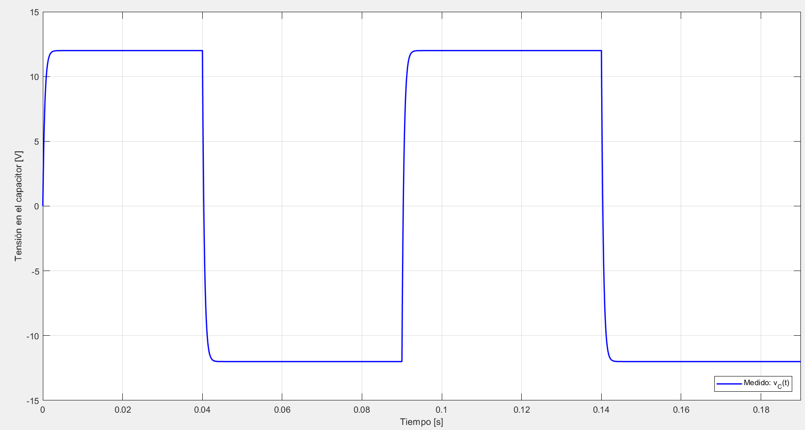

Ahora vamos a obtener la función G(s) a travez del método de Chen.

Entonces vamos a seleccionar 3 puntos de la gráfica, con los cuales obtendremos una gráfica similar a la de la planilla, como se observa en la imagen siguiente. 

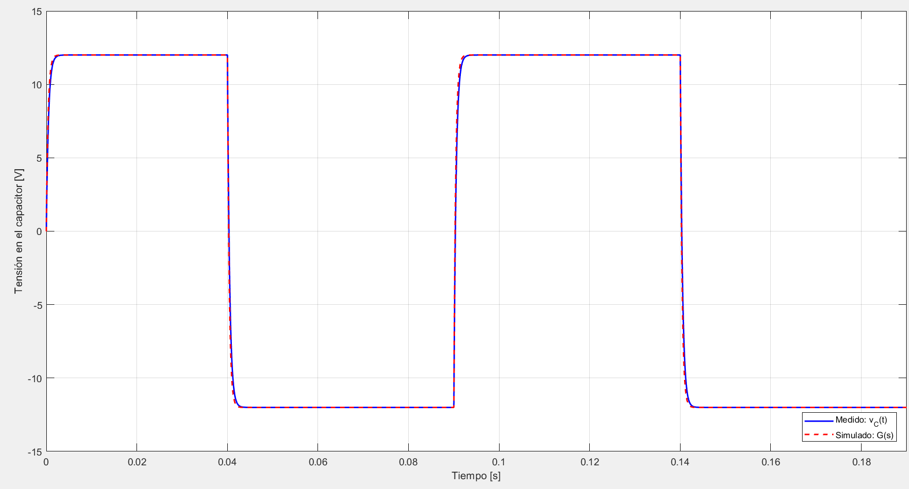

Con esta comparación podemos confirmar que la aproximación es correcta.

Luego, la función de transferecnia nos queda:

```
                 1
G = -------------------------------
    9.798e-10 s^2 + 0.0003879 s + 1

T1 = 2.5427e-06 s, 

T2 = 3.8533e-04 s,

R = 176.31 Ohm, L = 0.0004 H, C = 2.2e-06 F
```
### Codígo Matlab Ítem [2]

```
%% Item [2]
% Cargar datos desde Excel
archivo = 'Curvas_Medidas_RLC_2025.xls';
datos = xlsread(archivo);

t = datos(:,1);          % Tiempo [s]
vc = datos(:,3);         % Tensión en el capacitor [V]
vin = datos(:,4);        % Entrada [V]

% Detectar inicio del escalón
idx_escalon = find(abs(diff(vin)) > 5, 1);
t_rel = t(idx_escalon:end) - t(idx_escalon);
vc_rel = vc(idx_escalon:end);

% Normalizar salida
vc_final = 12;
y_norm = vc_rel / vc_final;

%% Buscar 3 puntos válidos para aplicar Chen
validado = false;
for i = 5:60
    for j = i+5:i+15
        for k = j+5:j+15
            if k < length(y_norm)
                y1 = y_norm(i); y2 = y_norm(j); y3 = y_norm(k);
                k1 = y1 - 1; k2 = y2 - 1; k3 = y3 - 1;
                be = 4*k1^3*k3 - 3*k1^2*k2^2 - 4*k2^3 + k3^2 + 6*k1*k2*k3;
                if be > 0
                    a1 = (k1*k2 + k3 - sqrt(be)) / (2 * (k1^2 + k2));
                    a2 = (k1*k2 + k3 + sqrt(be)) / (2 * (k1^2 + k2));
                    if 0 < a1 && a1 < 1 && 0 < a2 && a2 < 1
                        i1 = i; i2 = j; i3 = k;
                        validado = true;
                        break;
                    end
                end
            end
        end
        if validado, break; end
    end
    if validado, break; end
end

% Aplicar método de Chen
t1 = t_rel(i1); t2 = t_rel(i2); t3 = t_rel(i3);
y1 = y_norm(i1); y2 = y_norm(i2); y3 = y_norm(i3);
k1 = y1 - 1; k2 = y2 - 1; k3 = y3 - 1;
be = 4*k1^3*k3 - 3*k1^2*k2^2 - 4*k2^3 + k3^2 + 6*k1*k2*k3;

alpha1 = (k1*k2 + k3 - sqrt(be)) / (2 * (k1^2 + k2));
alpha2 = (k1*k2 + k3 + sqrt(be)) / (2 * (k1^2 + k2));
beta = (2*k1^3 + 3*k1*k2 + k3 - sqrt(be)) / sqrt(be);

T1 = -t1 / log(alpha1);
T2 = -t1 / log(alpha2);
T3 = beta * (T1 - T2) + T1;

% Coeficientes estimados
a2 = T1 * T2;
a1 = T1 + T2;

% Suposición de C
C = 2.2e-6;
R = a1 / C;
L = a2 / C;

fprintf('>> Parámetros estimados:\n');
fprintf('T1 = %.4e s, T2 = %.4e s\n', T1, T2);
fprintf('R = %.2f Ohm, L = %.4f H, C = %.1e F\n', R, L, C);

% Función de transferencia estimada
num = [1];
den = [L*C R*C 1];
G = tf(num, den);

% Simulación extendida y comparación (hasta 20 ms)
%t_sim = t_rel(1:20000);  % Extender simulación a 20 ms
N = min(20000, length(t_rel));   % asegurarse de no pasarse del largo real
t_sim = t_rel(1:N);
u = vin(idx_escalon : idx_escalon + N - 1);
vc_trunc = vc(idx_escalon : idx_escalon + N - 1);

u = vin(idx_escalon : idx_escalon + length(t_sim) - 1);
u = u(:); % asegurar vector columna
[ysim, ~] = lsim(G, u, t_sim);

% Curva medida para comparar
vc_trunc = vc(idx_escalon : idx_escalon + length(t_sim) - 1);

% Gráfico final
figure;
plot(t_sim, vc_trunc, 'b', 'LineWidth', 1.5); hold on;
plot(t_sim, ysim, 'r--', 'LineWidth', 1.5);
legend('Medido: v_C(t)', 'Simulado: G(s)', 'Location', 'Southeast');
%title('Comparación extendida: curva medida vs modelo estimado');
xlabel('Tiempo [s]');
ylabel('Tensión en el capacitor [V]');
grid on;
xlim([0 max(t_sim)]);
```

### Ítem [3]

Una vez obtenidos los valores del circuito, procedemos a simular y comparar las curvas de las corrientes. 

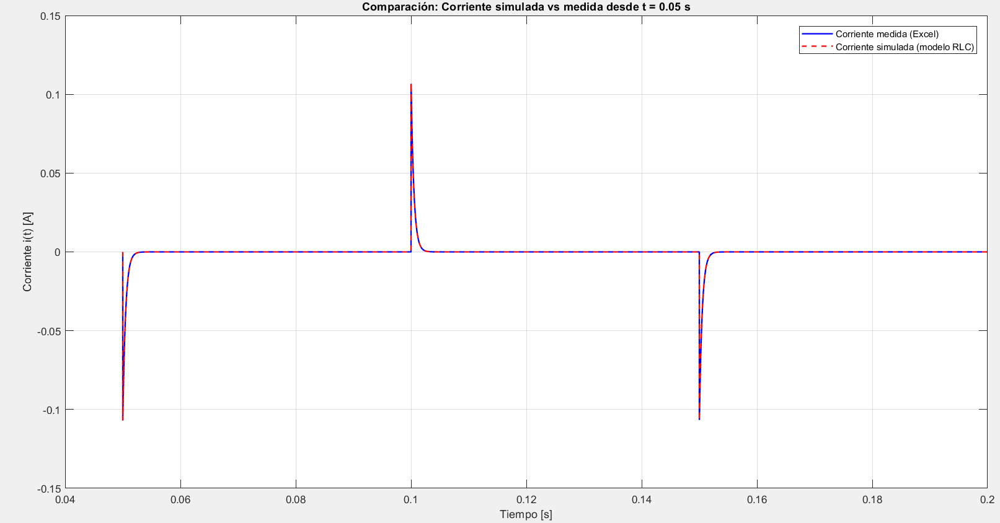

Donde vemos que nuevamente la aproximación del sistema a traves del método de Chen es correcto.

### Código Matlab Ítem [3]

```
%% Item [3]
t = datos(:,1);         % Tiempo [s]
i_meas = datos(:,2);    % Corriente [A]
vc = datos(:,3);        % Tensión en el capacitor [V]
vin = datos(:,4);       % Tensión de entrada [V]

% Parámetros obtenidos con Chen (ítem 2)
R = 220.31; %para que coincida la grafica aumento levemente la resistencia
L = 0.0004;
C = 2.2e-06; 

% Calcular ganancia real desde la respuesta al escalón
% Detectar inicio del escalón
idx_escalon = find(abs(diff(vin)) > 5, 1);
vc_rel = vc(idx_escalon:end);

K_real = max(vc_rel);  % salida final real del sistema (aprox 12?V)

% Función de transferencia con ganancia corregida
num = [K_real];
den = [L*C R*C 1];
G = tf(num, den);

% Modelo en espacio de estados con salida la corriente i(t)
A = [-R/L -1/L;
      1/C   0 ];
B = [1/L; 0];
C_i = [1 0];   % salida: corriente
D = 0;

sys_i = ss(A, B, C_i, D);

% Simular corriente con entrada real
t_sim = t;
u = vin(:);                   
i_sim = lsim(sys_i, u, t_sim); 

% Recorte desde t = 0.05 s en adelante
idx_inicio = find(t >= 0.05, 1);
t_crop = t(idx_inicio:end);
i_sim_crop = i_sim(idx_inicio:end);
i_meas_crop = i_meas(idx_inicio:end);

% Graficar comparación
figure;
plot(t_crop, i_meas_crop, 'b', 'LineWidth', 1.4); hold on;
plot(t_crop, i_sim_crop, 'r--', 'LineWidth', 1.4);
xlabel('Tiempo [s]');
ylabel('Corriente i(t) [A]');
legend('Corriente medida (Excel)', 'Corriente simulada (modelo RLC)');
title('Comparación: Corriente simulada vs medida desde t = 0.05 s');
grid on;
```

A continuación se deja el link donde podran encontrar el código Matlab completo del caso de estudio N°1.
### [Código Matlab del Caso de estudio 1](Scarlatto_Manuel_TPN1_Caso_1.m)

---
## Caso de estudio 2. Sistema de tres variables de estado

Dadas las ecuaciones del motor de corriente continua con torque de carga $T_L$ no nulo, con los parámetros  
$L_{AA} = 366 \cdot 10^{-6} ,  J = 5 \cdot 10^{-9} ,  R_A = 55.6 ,  B = 0 ,  K_i = 6.49 \cdot 10^{-3} ,  K_m = 6.53 \cdot 10^{-3} $:

$$ \frac{d i_a}{dt} = -\frac{R_A}{L_{AA}} i_a - \frac{K_m}{L_{AA}} \omega_r + \frac{1}{L_{AA}} v_a \tag{1-5} $$

$$ \frac{d \omega_r}{dt} = \frac{K_i}{J} i_a - \frac{B_m}{J} \omega_r - \frac{1}{J} T_L \tag{1-6} $$

$$ \frac{d \theta}{dt} = \omega_r \tag{1-7} $$

### Ítem [4]  
Obtener el torque máximo que puede soportar el motor modelado mediante las ecuaciones (1-5), (1-6) y (1-7) cuando se lo alimenta con **12 V**, graficando por **5 segundos** de tiempo la **velocidad angular** y **corriente $i_a$** para establecer su valor máximo, como para dimensionar dispositivos electrónicos.

### Ítem [5]  
A partir de las curvas de mediciones de las variables graficadas en la **Fig. 1-3**, se requiere obtener el modelo del sistema considerando como entrada un escalón de **12 V**, como salida a la **velocidad angular**, y al **torque de carga $T_L$** aplicado una perturbación. En el archivo [**Curvas_Medidas_Motor_2025.xls**](Curvas_Medidas_Motor_2025_v.xls) están las mediciones, en la **primer hoja los valores** y en la **segunda los nombres**. Se requiere obtener el **modelo dinámico**, para establecer las constantes del modelo (1-5), (1-6).

### Ítem [6]  
Implementar un **PID en tiempo discreto** para que el **ángulo del motor** permanezca en una referencia de **1 radian**, sometido al **torque descripto en la Fig. 1-3**.  
**Tip**: partir de $K_P = 0.1$, $K_I = 0.01$, $K_D = 5$.

<figure>
  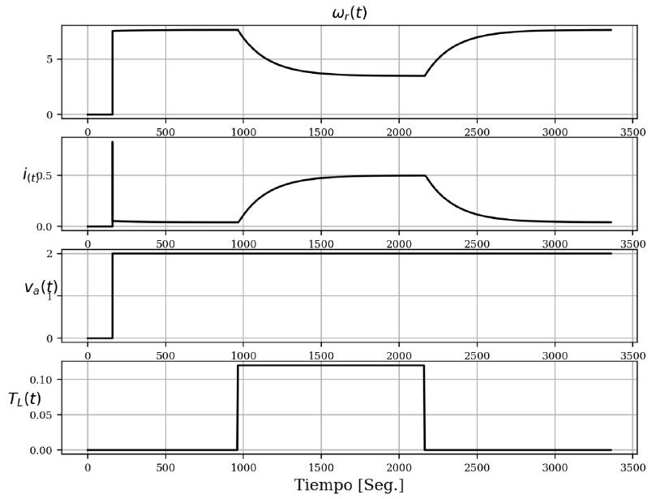
  <figcaption><em>Figura 1-3. Curvas de un motor CC para una entrada de 2V.</em></figcaption>
</figure>

## Desarrollo

### Ítem [4]

A traves de la integración de Euler podemos observar el comportamiento de las variables, en primera instancia veremos como se comporte sin aplicar el torque de carga:

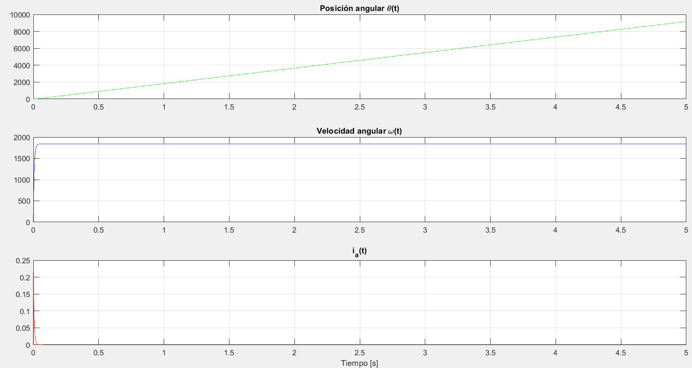

Se observa como la posición de $\theta(t)$ crece a medida que gira el motor, mientras que la velocidad angular ($\omega(t)$) se mantiene constante y la corriente $i_a(t)$ presenta un pico de corriente y luego disminuye mucho su valor dado que no hay carga.

Realizando iteraciones, se llego al valor de $T_Lmáx = 1.4007e-3 [N*m]$; donde podemos observar que la velocidad del motor es practicamente nula ($\omega(t)=0.0255 [rad/s]$) y la corriente toma un valor de $i_a(t) = 216 [mA]$.

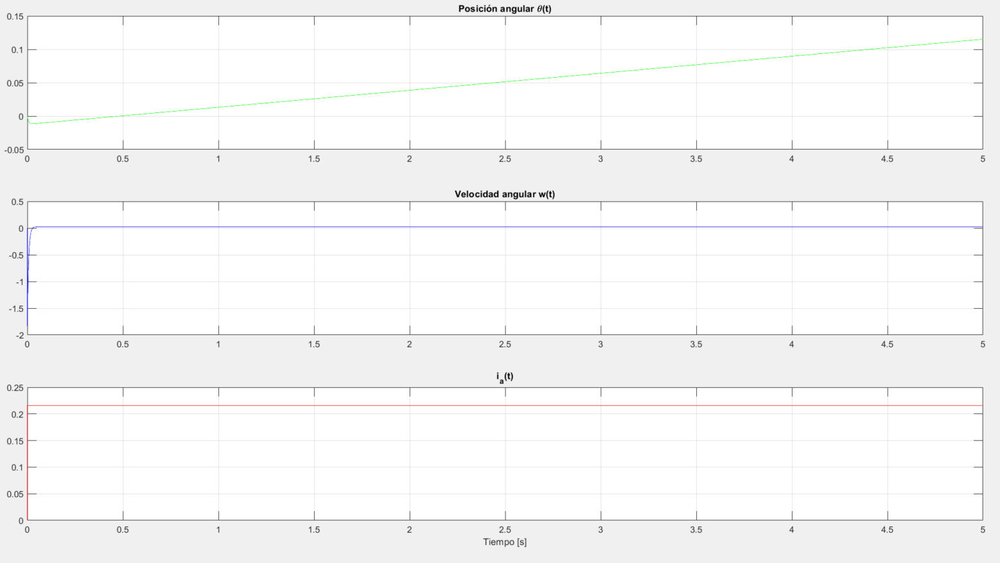

### Código Matlab Ítem [4]

```
%% Item [4]
L_AA = 366e-6;      % Inductancia de armadura (H)
R_A = 55.6;         % Resistencia de armadura (Ohm)
J = 5e-9;           % Momento de inercia (kg·m^2)
B = 0;              % Coeficiente de fricción (despreciable)
K_i = 6.49e-3;      % Constante de torque (N·m/A)
K_m = 6.53e-3;      % Constante de fuerza contraelectromotriz (V·s/rad)
%T_L = 0;
T_L = 1.4007e-3;    % Torque de carga (N·m)
v_a = 12;           % Voltaje de entrada (V)

% Condiciones iniciales
i_a = 0;            % Corriente de armadura inicial (A)
omega = 0;          % Velocidad angular inicial (rad/s)
theta = 0;          % Posición angular inicial (rad)

% Tiempo de simulación
T_total = 5;        % Tiempo total de simulación (s)
dt = 1e-7;          % Paso de tiempo (s)
N = T_total / dt;   % Número de pasos de simulación

% Prealocación de vectores para almacenar resultados
t = zeros(1, N);
i_a_vec = zeros(1, N);
omega_vec = zeros(1, N);
theta_vec = zeros(1, N);

% Simulación utilizando el método de Euler
for k = 1:N
    % Almacenar resultados actuales
    t(k) = (k-1) * dt;
    i_a_vec(k) = i_a;
    omega_vec(k) = omega;
    theta_vec(k) = theta;
    
    % Cálculo de derivadas
    di_a = (-R_A * i_a - K_m * omega + v_a) / L_AA;
    domega = (K_i * i_a - B * omega - T_L) / J;
    dtheta = omega;
    
    % Actualización de variables utilizando el método de Euler
    i_a = i_a + dt * di_a;
    omega = omega + dt * domega;
    theta = theta + dt * dtheta;
end

% Gráficas de resultados
figure;
subplot(3,1,1);
plot(t, theta_vec, 'g');
title('Posición angular \theta(t)');
grid on;


subplot(3,1,2);
plot(t, omega_vec, 'b');
title('Velocidad angular w(t)');
grid on;

subplot(3,1,3);
plot(t, i_a_vec, 'r');
title('i_a(t)');
xlabel('Tiempo [s]');
grid on;

% Mostrar valores máximos
fprintf('Valor máximo de i_a(t): %.4f A\n', max(i_a_vec));
fprintf('Valor máximo de w(t): %.4f rad/s\n', max(omega_vec));
fprintf('Valor máximo de theta(t): %.4f rad\n', max(theta_vec));
```

### Ítem [5]

Ahora realizaremos una aproximación a la curva tal cual como lo hicimos en el Item [2] a partir del articulo de [Chen](<Archivo de Chen.pdf>); entonces, tomamos 3 puntos de la curva y obtenemos: 

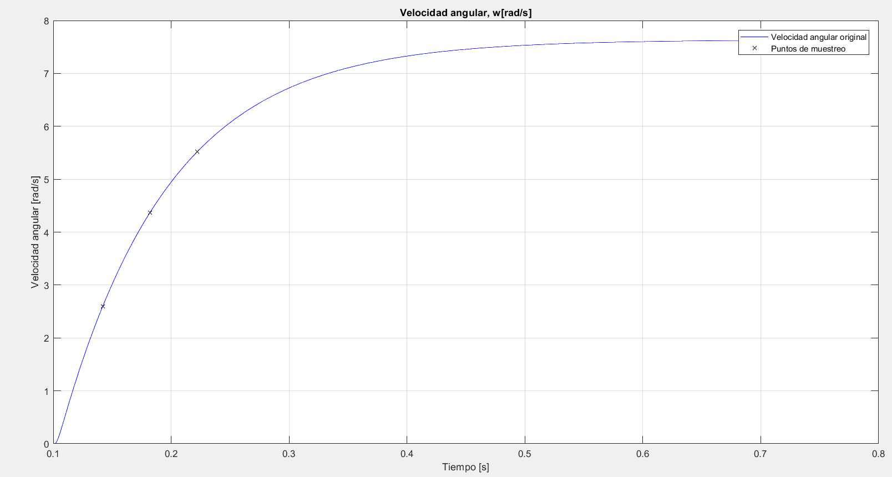

La función de transferencia del sistema es la siguiente:

```
                0.2656
FT = ---------------------------------
     0.0006561 s^2 + 0.0172 s + 0.0705
```

Ahora, graficamos la aproximación y podemos observar como esta se asemeja a la real.

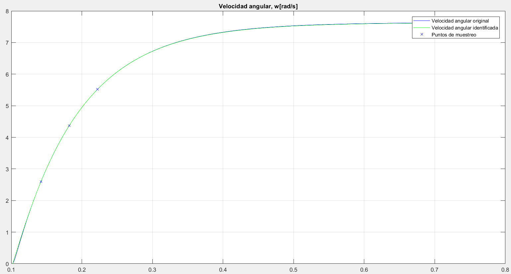

Siendo la corriente de armadura la siguiente:

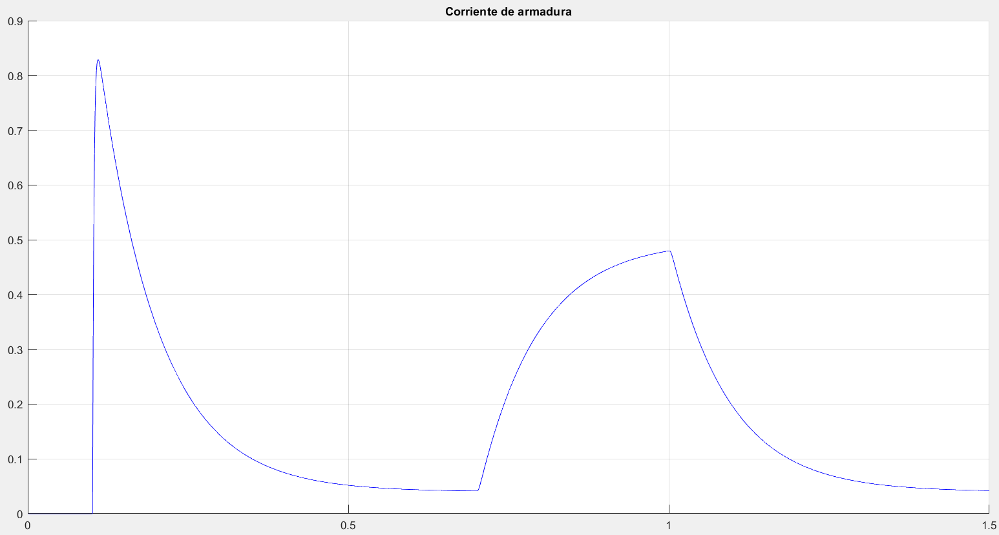

---